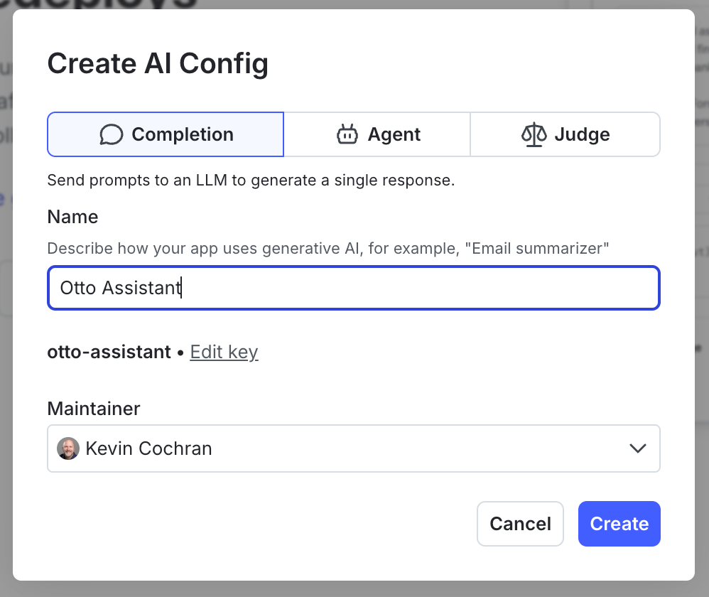

# Meet Otto

ToggleWear wants an AI shopping assistant on the storefront, and we're going to build it. We've named him Otto. Right now he's a placeholder — the chat widget on the [ToggleWear](#tab-1) tab returns a canned "not wired up yet" line. We're going to fix that.

By the end of this challenge:

- Otto exists as a **Config** in AgentControl.
- He has a starting prompt and a starting model (Claude Haiku 4.5 on Bedrock).
- The ToggleWear app evaluates the Config on each `/chat` call.
- Otto says his first real words.

# Create Otto's Config

Open the [LaunchDarkly](#tab-0) tab.

1. From the left-hand navigation, where you see the **Code | Agents** selector, click Agents
2. Under Agents, click **Configs**.
3. Click **Create config** in the upper right.
4. For **Name**, enter:
```text
Otto Assistant
```
5. For **Key**, the UI should pre-fill `otto-assistant`. Confirm or set it to:
```text
otto-assistant
```
6. For **Mode**, select **Completion**.
7. Click **Create**.



# Add Otto's first variation

The Config exists but has no variations yet — nothing to serve. Add the "born" variation.

1. You are now on the Config detail page, adding the first variation.
2. For **Name**, enter:
```text
Otto (Born)
```
3. For **Key**, confirm or enter:
```text
otto-born
```
4. Under **Model**, in the search box, paste and select:
```text
anthropic.claude-haiku-4-5-20251001-v1:0
```
5. In the prompt text area, select **System**, and add this content in the prompt:
```text
You are a customer service assistant for ToggleWear, an online retailer. Answer questions from customers about products and store policies. Be accurate and concise.
```
6. Click **Review and save**, then **Save changes**.

# Turn Otto on in `Test`

By default Otto's `Test` environment is serving the placeholder "disabled" variation. Switch it to the Born variation we just created.

1. Click the **Targeting** tab.
2. Make sure the environment selector reads **Test**.
3. Under **Default rule**, click **Edit** and select **Otto (Born)**.
4. Click **Review and save**, then **Save changes**.

# Wire Otto into the app

Open the [Code Editor](#tab-2) tab. Open `server.py`.

Find the block marked:

```python
# ─────────────────────────────────────────────────────────────────────
# Challenge 01 paste block — replace this stub with real Otto code.
```

Replace **everything between the opening marker and the** `# ─── End Challenge 01 paste block ────` **line** with:

```python
    # Build context, evaluate the otto-assistant Config.
    context = Context.builder(req.session_id).set("tier", req.user_tier).build()
    cfg = ai_client.completion_config(OTTO_CONFIG_KEY, context, FALLBACK_CONFIG)

    if not cfg.enabled or cfg.model is None:
        return JSONResponse(status_code=503, content={
            "response": "Otto isn't enabled. Check the Config targeting.",
            "turn": turn, "turn_limit": TURN_LIMIT,
        })

    # Translate the Config's messages into Bedrock Converse format.
    system_blocks = []
    seed_messages = []
    for m in cfg.messages or []:
        if m.role == "system":
            system_blocks.append({"text": m.content})
        else:
            seed_messages.append({"role": m.role, "content": [{"text": m.content}]})

    # Merge in this session's prior turns + the new user message.
    with _state_lock:
        prior = list(_history[req.session_id])
    history_blocks = [{"role": m.role, "content": [{"text": m.content}]} for m in prior]
    bedrock_messages = seed_messages + history_blocks + [
        {"role": "user", "content": [{"text": req.message}]}
    ]

    model_id = resolve_bedrock_model(cfg.model.name)
    tracker = cfg.create_tracker()

    try:
        response = tracker.track_bedrock_converse_metrics(
            bedrock.converse(modelId=model_id, messages=bedrock_messages, system=system_blocks)
        )
    except ClientError as e:
        code = e.response.get("Error", {}).get("Code")
        log.error("Bedrock ClientError: %s", code)
        return JSONResponse(status_code=502, content={
            "response": _bedrock_user_message(code),
            "turn": turn, "turn_limit": TURN_LIMIT,
        })

    assistant_text = _extract_text(response)
    with _state_lock:
        _history[req.session_id].append(LDMessage(role="user", content=req.message))
        _history[req.session_id].append(LDMessage(role="assistant", content=assistant_text))

    usage = response.get("usage") or {}
    metrics = response.get("metrics") or {}
    log.info(
        "chat session=%s tier=%s turn=%d model=%s tokens_in=%s tokens_out=%s latency_ms=%s",
        req.session_id, req.user_tier, turn, model_id,
        usage.get("inputTokens"), usage.get("outputTokens"), metrics.get("latencyMs"),
    )

    # ─── Challenge 07 judge injects below this marker ──────────────────────
```

Save the file (⌘ + S/Ctrl + S). The ToggleWear service auto-reloads.

Read through the block of code to note how the LaunchDarkly AI SDK gets the model
configuration, then passes that on to the Bedrock SDK.

# Say hi to Otto

Open the [ToggleWear](#tab-1) tab. Click **Chat with Otto** in the bottom-right. Ask him something — try:

```text
Got any t-shirts?
```

Otto should answer for real this time. He'll be brief and a little robotic — that's by design; we'll fix his voice in the next challenge.

# Two audiences, two Ottos

Before we leave this challenge, one more thing: free shoppers and premium ToggleWear members get different treatment everywhere else on the site. Otto should be no exception. Premium customers get more time, more detail, and a more capable model behind the answers.

We're going to:

1. Add a second variation backed by **Claude Sonnet 4.6** with a richer premium-tier prompt.
2. Add a **targeting rule** that routes premium customers to that variation. Free shoppers keep getting the Haiku-backed Otto.
3. Test by flipping the user-tier dropdown on ToggleWear.

# Add the premium variation

Open the [LaunchDarkly](#tab-0) tab. Go to **Configs** → **Otto Assistant**.

1. Click **Add variation**.
2. For **Name**, enter:
```text
Otto (Premium)
```
3. For **Key**, confirm or enter:
```text
otto-premium
```
4. Under **Model**, in the search box, paste and select:
```text
anthropic.claude-sonnet-4-6
```
5. In prompt text area, make sure **System** is selected and enter the following text:

```text
You work at ToggleWear and you're talking to a premium customer. Take a little more time with them. Offer thoughtful recommendations, mention complementary items when relevant, and share interesting product details (materials, care, the story behind a design). You can be a bit warmer and more conversational.
```
6. Click **Review and save**, then **Save changes**.

Before you continue, due to caching in the virtual browser, you'll need to refresh the virtual browser (not your browser).


# Route premium shoppers to the premium Otto

Click the **Targeting** tab. Make sure the environment selector reads **test**.

1. Above the **Default rule**, click **+** and select **Build a custom rule**.
2. Press `]` to hide the right pane.
3. Build the clause:
	1. Context kinds: **user**
	2. Attribute: **tier**
	3. Operator: **is one of**
	4. Values: **premium** _&lt;ENTER&gt;_
    > (a) You may need to manually enter **tier**. (b) After you type in **premium** you must press the Enter key.
4. For the variation dropdown, select **Otto (Premium)**.
5. Leave the **Default rule** as **Otto (Born)** — free shoppers and anyone without a tier still get the Haiku Otto.
6. Click **Review and save**, then **Save changes**.

# See it work

Open the [ToggleWear](#tab-1) tab. The header has a **Logged in as** dropdown. It defaults to **Free user**.

1. With **Free user** selected, click **Chat with Otto** and ask a question:
```text
What's good for cold weather?
```
Otto should be brief and friendly — that's the Haiku-backed Born variation.

2. Close the chat. At the top right of the page, change the dropdown to **Premium user**.

3. Re-open the chat (or refresh the page) and ask the same question. Otto should answer at more length, mention complementary items, and feel a bit warmer — that's the Sonnet-backed Premium variation, served because the LaunchDarkly context now has `tier: "premium"` and the rule you just added matches it.

The app's code didn't change. The variation you served changed because LaunchDarkly evaluated the targeting rule against the context.

In the next challenge we'll give Otto a personality — and we'll do it without redeploying anything.

Click **Check** when you're satisfied.
